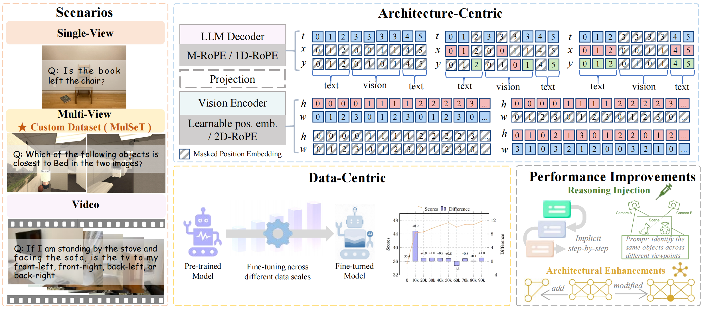

# Why Do MLLMs Struggle with Spatial Understanding? A Systematic Analysis from Data to Architecture

Our paper: https://arxiv.org/abs/2509.02359

MulSeT Benchmark: https://huggingface.co/datasets/WanyueZhang/MulSeT

## Directory structure
```bash
.
├── Architecture-Centric
│   ├── llava-onevision-qwen2-7b-ov
│   │   ├── multi_image_llavaov.py
│   │   ├── siglip_encoder.py
│   │   ├── single_image_llavaov.py
│   │   └── utils.py
│   ├── Mono-InternVL-2B
│   │   ├── modeling_intern_patch.py
│   │   ├── single_image_mono.py
│   │   └── utils.py
│   └── Qwen2.5-VL-7B-Instruct
│       ├── modeling_qwen2_5_vl.py
│       ├── multi_image_qwen.py
│       └── single_image_qwen.py
├── Data-Centric
│   ├── multi_image
│   │   └── nav_iTHOR_10000.sh
│   └── video
│       └── run_space.sh
├── README.md
└── visualize
    ├── multi_image
    │   ├── visualize_2images_llavaov_attention.py
    │   ├── visualize_2images_qwen2.5_attention_Explicit-Multi-view-CoT.py
    │   ├── visualize_2images_qwen2.5_attention_Explicit-Stepwise-CoT.py
    │   ├── visualize_2images_qwen2.5_attention_Implicit-Multi-view.py
    │   ├── visualize_2images_qwen2.5_attention_Implicit-Stepwiset.py
    │   └── visualize_2images_qwen2.5_attention.py
    └── single_image
        ├── visualize_1image_llavaov_attention.py
        └── visualize_1image_qwen2.5_attention.py
```

## Document Description
This code package encompasses modifications for comparative experiments, data-related scripts, and attention visualization tools, structured as follows:


*Overview of our study on spatial reasoning in MLLMs. The terms t, x, y, h, and w denote different dimensions of position embeddings.

### Architecture-Centric​

#### Model Positional Encoding Files (for Comparative Experiments)​
This directory contains positional encoding modifications for comparative experiments across three models, aiming to explore the impact of different positional encoding strategies on model performance.


1. llava-onevision-qwen2-7b-ov​
- siglip_encoder.py: Alters SigLIP encoder (visual) positional encoding to facilitate comparison of visual position feature extraction results.​
- utils.py: Tweaks LLM positional encoding to compare text sequence position understanding performances.​
- multi_image_llavaov.py: Related to multi-image processing under the llava-onevision-qwen2-7b-ov model architecture.
- single_image_llavaov.py: Related to single-image processing under the llava-onevision-qwen2-7b-ov model architecture.

2. Mono-InternVL-2B​
- modeling_intern_patch.py: Refines visual patch positional encoding for comparing position processing accuracy.​
- utils.py: Adapts LLM positional encoding to fit model architecture and tasks, supporting comparative tests.
- single_image_mono.py: Related to single-image processing under the Mono-InternVL-2B model architecture.

3. Qwen2.5-VL-7B-Instruct
- modeling_qwen2_5_vl.py: (Implied positional encoding adjustments for the Qwen2.5-vl model to support comparative experiments on position processing).
- multi_image_qwen.py: Related to multi-image processing under the Qwen2.5-vl model architecture.
- single_image_qwen.py: Related to single-image processing under the Qwen2.5-vl model architecture.

## Data-Centric​
This directory is designed to verify the impact of increasing data volume on model performance, with subdirectories for different data types and corresponding example scripts.​

1. multi_image
- nav_iTHOR_10000.sh: An example script related to multi-image data, which can be used to process or utilize multi-image datasets to explore the effect of multi-image data volume on model performance.

2. video
- run_space.sh: An example script for video data, serving to handle or make use of video datasets to study how video data volume influences model performance.


*A high-level overview of MulSeT.

## Visualization Scripts (visualize folder)​
This directory contains scripts for visualizing the attention distribution of models, helping to understand the attention focus of models in different scenarios intuitively.

1. singe_image
- visualize_1image_llavaov_attention.py: Shows llava-onevision-qwen2-7b-ov's single-image attention distribution.​
- visualize_1image_qwen2.5_attention.py: Displays Qwen2.5-related models' single-image attention focus.​


2. multi_image
- visualize_2images_llavaov_attention.py: Visualizes attention patterns for the llava-onevision-qwen2-7b-ov model when processing two images, emphasizing cross-image attention connections (e.g., how regions in one image attend to regions in the other).
- visualize_2images_qwen2.5_attention.py: Illustrates basic attention mechanisms of Qwen2.5-VL models in two-image scenarios, including intra-image and inter-image attention flows.
- visualize_2images_qwen2.5_attention_Explicit-Multi-view-CoT.py: Focuses on attention visualization for Qwen2.5-VL under the "Explicit Multi-view Chain-of-Thought" strategy, showing how step-by-step reasoning affects attention across two images.
- visualize_2images_qwen2.5_attention_Explicit-Stepwise-CoT.py: Visualizes attention for Qwen2.5-VL using the "Explicit Stepwise Chain-of-Thought" approach, highlighting how attention shifts during sequential reasoning over two images.
- visualize_2images_qwen2.5_attention_Implicit-Multi-view.py: Shows attention distributions for Qwen2.5-VL under "Implicit Multi-view" processing, where cross-image reasoning occurs without explicit step-by-step prompts.
- visualize_2images_qwen2.5_attention_Implicit-Stepwise.py: Visualizes attention for Qwen2.5-VL using "Implicit Stepwise" processing, illustrating gradual attention shifts during implicit reasoning over two images.


*Case study of attention visualization. Each column corresponds to a pair of input images (left and right), and each row shows the attention maps from the 21st and 27th layers of the model, respectively.

